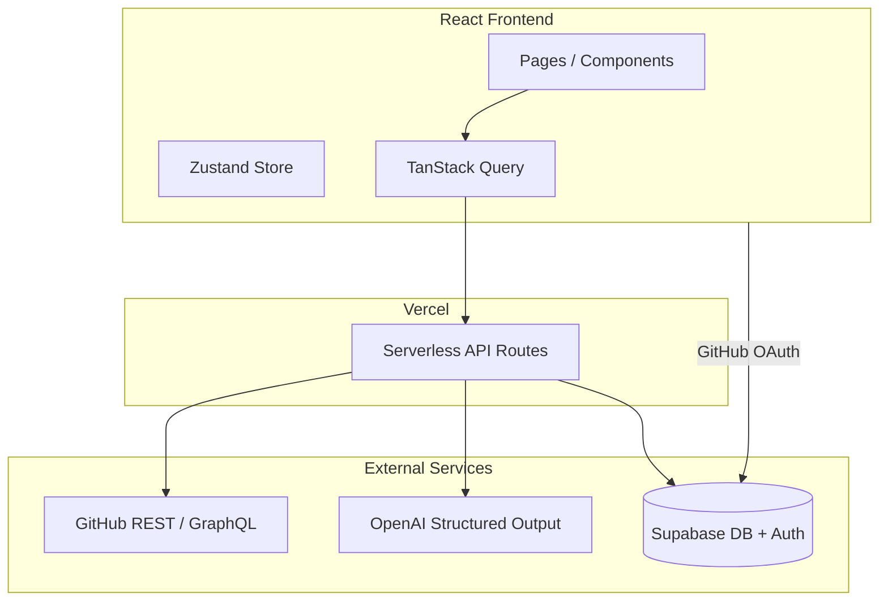
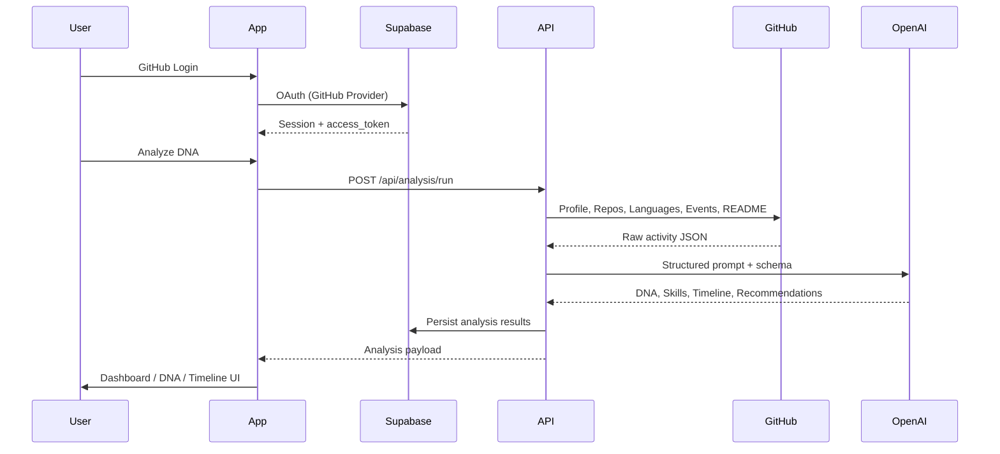

# DevCompass 웹앱 구현 계획

## 현재 상태

- 코드베이스 없음 (문서 + HTML 목업만 존재)
- 디자인: [Design/devcompass_intelligence/DESIGN.md](Design/devcompass_intelligence/DESIGN.md) + 4개 페이지 목업
  - [Design/devcompass_dashboard/code.html](Design/devcompass_dashboard/code.html)
  - [Design/developer_dna/code.html](Design/developer_dna/code.html)
  - [Design/growth_timeline/code.html](Design/growth_timeline/code.html)
  - [Design/ai_career_coach/code.html](Design/ai_career_coach/code.html)
- 기능 범위: PRD 전체 (MVP 7개 + Job Matching, Resume, GitHub University, Weekly Report 등)
- 연동: GitHub OAuth, Supabase, OpenAI 실제 연동

---

## 아키텍처



### 데이터 파이프라인



---

## 기술 스택 (PRD 준수)

| 영역 | 선택 |
|------|------|
| Frontend | React 18, Vite, TypeScript, Tailwind CSS, shadcn/ui, Zustand, TanStack Query, Recharts |
| Backend | Vercel Serverless Functions (`/api/*`) |
| DB/Auth | Supabase (PostgreSQL + GitHub OAuth) |
| AI | OpenAI API (Structured JSON Output) |
| 배포 | Vercel |

---

## 프로젝트 구조

```
DevCompass/
├── src/
│   ├── components/
│   │   ├── layout/          # Sidebar, TopBar, AppShell
│   │   ├── ui/              # shadcn/ui
│   │   ├── charts/          # Recharts (Radar, Bar, Heatmap)
│   │   └── shared/          # InsightCard, DnaTag, SkillTag
│   ├── pages/               # 13개 라우트 페이지
│   ├── hooks/               # useAuth, useAnalysis, useCareerCoach
│   ├── stores/              # authStore, analysisStore
│   ├── lib/                 # supabase client, api client, utils
│   └── types/               # Analysis, DNA, Portfolio schemas
├── api/
│   ├── github/sync.ts       # GitHub 데이터 수집
│   ├── analysis/run.ts      # AI 분석 오케스트레이션
│   ├── career-coach/chat.ts # Career Coach 대화
│   ├── portfolio/generate.ts
│   ├── resume/generate.ts
│   ├── jobs/match.ts
│   ├── repos/recommend.ts
│   ├── university/missions.ts
│   └── reports/weekly.ts
├── supabase/migrations/     # DB 스키마
├── tailwind.config.ts       # DESIGN.md 토큰 이식
├── vercel.json
└── .env.example
```

---

## Phase 1: 프로젝트 기반 + 디자인 시스템

### 1.1 Vite + React + TypeScript 스캐폴딩

- `npm create vite@latest` (react-ts)
- Tailwind CSS, shadcn/ui 초기화
- React Router v6, Zustand, TanStack Query, Recharts 설치

### 1.2 디자인 토큰 이식

[DESIGN.md](Design/devcompass_intelligence/DESIGN.md)의 colors, typography, spacing, rounded 값을 `tailwind.config.ts`에 그대로 반영 (HTML 목업의 tailwind-config와 동일).

추가 글로벌 스타일:
- Inter + JetBrains Mono (Google Fonts)
- Material Symbols Outlined
- `.ai-insight-glow`, `.insight-card`, `.dna-tag`, `.skill-tag`, `.glass-card` 등 목업 CSS 클래스

### 1.3 공통 레이아웃

HTML 목업 기준 공통 Shell:

- **Sidebar** (260px 고정): 13개 네비게이션 + "Analyze DNA" CTA
- **TopBar**: 검색, 알림, 동기화, AI Assistant, 프로필 아바타
- **AppShell**: `ml-[260px]` 메인 콘텐츠 영역

라우트 구조:

| Path | Page | 디자인 목업 |
|------|------|------------|
| `/` | Landing (비로그인) | 신규 |
| `/dashboard` | Dashboard | O |
| `/developer-dna` | Developer DNA | O |
| `/skill-analysis` | Skill Analysis | Dashboard 일부 재사용 |
| `/growth-timeline` | Growth Timeline | O |
| `/career-coach` | AI Career Coach | O |
| `/learning-roadmap` | Learning Roadmap | 신규 |
| `/repo-recommendations` | Repository Recommendations | 신규 |
| `/job-matching` | Job Matching | 신규 |
| `/portfolio` | AI Portfolio | 신규 |
| `/resume` | AI Resume | 신규 |
| `/github-university` | GitHub University | 신규 |
| `/weekly-report` | Weekly Report | 신규 |
| `/settings` | Settings | 신규 |

---

## Phase 2: Supabase + GitHub OAuth

### 2.1 Supabase 설정

- GitHub OAuth Provider 활성화 (Supabase Dashboard)
- `.env.example` 작성:

```
VITE_SUPABASE_URL=
VITE_SUPABASE_ANON_KEY=
SUPABASE_SERVICE_ROLE_KEY=
GITHUB_CLIENT_ID=
GITHUB_CLIENT_SECRET=
OPENAI_API_KEY=
```

### 2.2 DB 스키마 (`supabase/migrations/001_initial.sql`)

핵심 테이블:

- `profiles` — user_id, github_username, avatar_url, bio, public_repos, created_at
- `github_tokens` — user_id, access_token (encrypted), scopes
- `github_snapshots` — user_id, raw_data (JSONB), synced_at
- `analysis_results` — user_id, dna, skill_scores, growth_timeline, career_story, tech_stack (JSONB)
- `career_coach_messages` — user_id, role, content, created_at
- `learning_roadmap` — user_id, items (JSONB)
- `repo_recommendations` — user_id, repos (JSONB)
- `job_matches` — user_id, job_title, match_score, gaps (JSONB)
- `portfolios` — user_id, content (JSONB), format
- `resumes` — user_id, type (resume/cover/linkedin), content (JSONB)
- `university_missions` — user_id, daily/weekly missions (JSONB)
- `weekly_reports` — user_id, week_start, report (JSONB)

RLS: 모든 테이블 `auth.uid() = user_id` 기준 row-level security.

### 2.3 Auth 플로우

- Supabase `signInWithOAuth({ provider: 'github', options: { scopes: 'read:user repo' } })`
- 로그인 후 `/dashboard` 리다이렉트
- Protected Route: 미인증 시 `/` Landing으로

---

## Phase 3: GitHub 데이터 수집 API

[SPEC_GitStroy.md](docs/SPEC_GitStroy.md) 및 PRD 4.1 기준 `api/github/sync.ts`:

| 소스 | GitHub API | 수집 데이터 |
|------|-----------|------------|
| Profile | `GET /user` | bio, repos count, followers, created_at |
| Repos | `GET /user/repos` | name, description, stars, forks, topics, language |
| Languages | `GET /repos/{owner}/{repo}/languages` | 언어별 bytes |
| Starred | `GET /user/starred` | 관심 기술 추출 |
| README | `GET /repos/{owner}/{repo}/readme` | 대표 프로젝트 분석 |
| Events | GraphQL contributionCalendar | 커밋/PR/Issue 히스토리 |

- OAuth token으로 5,000 req/hr 한도 활용
- 결과를 `github_snapshots`에 JSONB 저장
- 프론트: "Sync" 버튼 → TanStack Query mutation

---

## Phase 4: AI 분석 엔진

### 4.1 Structured Output 스키마 (`src/types/analysis.ts`)

GitStory 스키마 + PRD 확장:

```typescript
interface AnalysisResult {
  developer_slogan: string;
  developer_dna: string[];           // AI Agent Builder, Backend Engineer, ...
  primary_archetype: string;
  dna_stability_score: number;
  skill_scores: Record<SkillDomain, number>;  // Backend, Frontend, AI, ...
  growth_timeline: TimelineMilestone[];
  career_story: string;
  tech_stack: { primary, secondary, exploring };
  strengths: string[];
  gaps: string[];
  learning_style: string[];
  highlight_projects: Project[];
  career_recommendations: Recommendation[];
  repo_recommendations: RepoRec[];
  job_match_preview: JobMatch[];
  weekly_insights: string;
}
```

### 4.2 API: `api/analysis/run.ts`

1. `github_snapshots`에서 최신 데이터 로드
2. README 전처리 (특수문자 제거, 토큰 절약)
3. OpenAI `response_format: { type: "json_schema" }` 호출
4. `analysis_results` 저장
5. 프론트 Dashboard/DNA/Timeline/Coach에 바인딩

"Analyze DNA" 버튼 → sync(필요 시) → analysis/run → 결과 페이지 갱신

---

## Phase 5: 디자인 목업 기반 핵심 페이지 (4개)

HTML 목업을 React 컴포넌트로 1:1 변환:

### Dashboard (`/dashboard`)
- Hero Profile Card (Career Score, DNA Rank, Consistency)
- AI Insight Card (보라색 left-border)
- Bento Grid: Career Score 차트(Recharts BarChart), Contribution Heatmap, Stats Cards
- Skill Radar (Recharts RadarChart), Language Distribution, Growth Timeline 미리보기

### Developer DNA (`/developer-dna`)
- Primary Archetype Hero (dark inverse-surface)
- AI Genetic Summary (insight-card)
- Bento: Strengths / Gaps / Learning Style / Stack
- Contribution Helix 차트

### Growth Timeline (`/growth-timeline`)
- Alternating timeline layout (좌우 교차 카드)
- Milestone nodes + AI 생성 스토리
- Velocity Breakdown + DNA Evolution 카드
- Particle canvas 배경 (선택)

### Career Coach (`/career-coach`)
- Chat UI (메시지 히스토리 + 입력)
- Right sidebar: Top Priorities, Skill Radar bars, Promotion Projection
- `api/career-coach/chat.ts`: OpenAI streaming 또는 non-streaming

---

## Phase 6: 나머지 기능 페이지

목업 없는 페이지는 DESIGN.md 컴포넌트 규칙 + Dashboard/DNA 패턴으로 구현:

### Skill Analysis (`/skill-analysis`)
- 8개 영역 Radar + 영역별 상세 점수/설명
- `analysis_results.skill_scores` 바인딩

### Learning Roadmap (`/learning-roadmap`)
- Career Coach 추천 기반 우선순위 로드맵
- 모듈별 진행률, 예상 시간

### Repository Recommendations (`/repo-recommendations`)
- AI 추천 repo 카드 (stars, topics, match reason)
- GitHub API + AI 분석 결과

### Job Matching (`/job-matching`)
- 채용공고 텍스트 입력 → AI 적합도 분석
- Gap analysis (MATCHED / HIGH GAP 뱃지 — Career Coach UI 재사용)

### Portfolio (`/portfolio`)
- Web Live Preview (분석 결과 바인딩)
- Export: Markdown 다운로드, PDF (`html2canvas` + `jspdf`)

### Resume (`/resume`)
- 이력서 / 자기소개서 / LinkedIn 프로필 탭
- AI 생성 + 편집 가능 textarea

### GitHub University (`/github-university`)
- Daily Mission, Weekly Challenge 카드
- README 학습 과제 + AI 피드백 요청

### Weekly Report (`/weekly-report`)
- 주간 성장 리포트 (기여, 스킬 변화, 추천 기술)
- Cron 또는 수동 생성 (`api/reports/weekly.ts`)

### Settings (`/settings`)
- GitHub 재연동, 데이터 삭제, 알림 설정

### Landing (`/`)
- Hero: "Navigate Your Developer Career with AI"
- GitHub Login CTA, 기능 소개 3~5개

---

## Phase 7: 상태 관리 + 데이터 흐름

- **Zustand** `authStore`: session, profile
- **Zustand** `analysisStore`: latest analysis, sync/analysis loading state
- **TanStack Query**:
  - `useProfile()`, `useAnalysis()`, `useCareerCoachMessages()`
  - staleTime 5분, sync/analysis 후 invalidate

---

## Phase 8: Vercel 배포

- `vercel.json`: SPA fallback + `/api/*` serverless
- 환경변수 Vercel Dashboard 등록
- Supabase Redirect URL에 Vercel 도메인 추가
- GitHub OAuth App callback URL 설정

---

## 환경변수 / 사전 준비 (사용자)

구현 전 아래가 필요합니다:

1. **Supabase 프로젝트** 생성 + GitHub Provider 설정
2. **GitHub OAuth App** (Client ID/Secret, callback: Supabase auth callback)
3. **OpenAI API Key**
4. **Vercel 계정** (배포 시)

`.env.example`과 README에 설정 가이드 포함.

---

## 구현 우선순위 (권장 순서)

```mermaid
gantt
    title DevCompass 구현 단계
    dateFormat X
    axisFormat %s

    section Foundation
    Scaffold_DesignSystem_Layout :0, 1
    section Backend
    Supabase_OAuth_DB :1, 2
    GitHub_Sync_API :2, 3
    AI_Analysis_Engine :3, 4
    section CoreUI
    Dashboard_DNA_Timeline_Coach :4, 6
    section Extended
    Skill_Portfolio_Resume :6, 7
    Roadmap_Repo_Job_Uni_Report :7, 9
    section Deploy
    Vercel_Polish :9, 10
```



---

## 주요 리스크 및 대응

| 리스크 | 대응 |
|--------|------|
| OpenAI API 비용/지연 | 분석 결과 Supabase 캐싱, 재분석은 sync 후에만 |
| GitHub Rate Limit | OAuth token 필수, repo/README는 top N개만 수집 |
| Private repo 접근 | OAuth scope `repo` 필요, 사용자 동의 UI |
| 전체 기능 범위 큼 | 공통 Shell/타입/API 패턴 먼저 확립 후 페이지별 확장 |

---

## 산출물

- 실행 가능한 React 웹앱 (`npm run dev`)
- Vercel Serverless API 8~10개
- Supabase migration SQL
- `.env.example` + README (설정/실행 가이드)
- Design 목업 4페이지 React 변환 + 9개 확장 페이지
